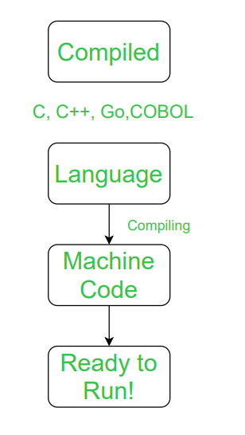
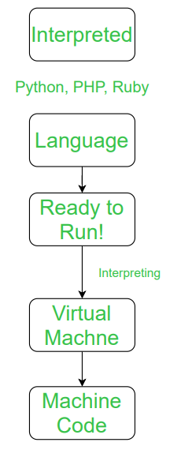
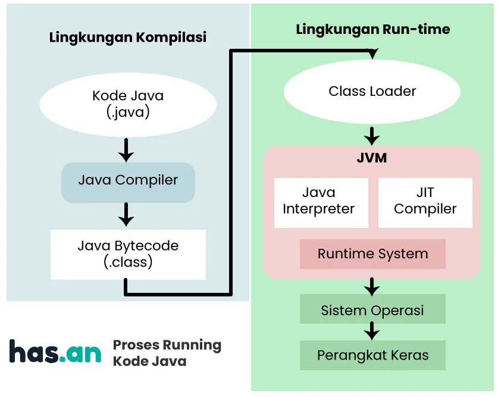

# Compiled Vs Interpreted Language

## A. Compiled Language (Bahasa Kompilasi)

### Apa Itu Bahasa Kompilasi (Compiled Language) ?

Compiled language adalah bahassa pemrograman yang membutuhkan proses compiled yang dilakukan oleh compiler, yaitu mengubah kode sumber (source code) program dalam bahasa pemrograman menjadi kode objek atau bahasa mesin yang dimengerti komputer untuk kemudian dieksekusi.

### Contoh Compiled Language

- C++
- C
- Golang / Go
- C#
- Rust
- DLL...

### Compilation Process (Proses Kompilasi)

<a href="https://media.geeksforgeeks.org/wp-content/uploads/20200326222732/com4.png">

</a>

## B. Interpreted Language

### Apa Itu Bahasa Interpretasi (Interpreted Language) ?

Interpreted language adalah bahassa pemrograman yang dijalankan melalui interpreter tanpa perlu dicompile kedalam bentuk bahasa masin. Proses Interpreted ini tidak langsung dieksekusi oleh mesin namun dibaca dan dieksekusi oleh program lain atau virtual machine yang terdapat didalamnya.

### Contoh Interpreted Language

- Python
- PHP
- Ruby
- Javascrpit
- Perl
- DLL...

### Interpretation Process

<a href="https://media.geeksforgeeks.org/wp-content/uploads/20200326222734/int2.png">

</a>

## JVM (Java Virtual Machine)

<a href="https://cdn.piksel.id/images/p9iu7fv6u31gki11ihi0ov43il7yqgkyeaehelh8.jpg">

</a>

## C. Perbedaan Compiled Language & Interpreted Language

| No | Compiled Language                                                                                                | Interpreted Language                                                                                                                                                                               |
| -- | ---------------------------------------------------------------------------------------------------------------- | -------------------------------------------------------------------------------------------------------------------------------------------------------------------------------------------------- |
| 1  | Compiled Language adalah bahasa pemrograman yang implementasinya biasanya berupa compiler dan bukan Interpreter. | Interpreted Language adalah bahasa pemrograman yang implementasinya mengeksekusi instruksi secara langsung dan bebas, tanpa terlebih dahulu menyusun suatu program menjadi instruksi bahasa mesin. |
| 2  | Dalam bahasa ini, setelah program dikompilasi, program tersebut dinyatakan dalam instruksi mesin target.         | Sedangkan pada bahasa ini, instruksi tidak langsung dieksekusi oleh mesin target.                                                                                                                  |
| 3  | Setidaknya ada dua langkah untuk beralih dari kode sumber ke eksekusi.                                           | Hanya ada satu langkah untuk beralih dari kode sumber ke eksekusi.                                                                                                                                 |
| 4  | Dalam bahasa ini, program yang dikompilasi berjalan lebih cepat daripada program yang diinterpretasikan.         | Sedangkan dalam bahasa ini, program yang diinterpretasikan dapat dimodifikasi saat program sedang berjalan.                                                                                        |
| 5  | Dalam bahasa ini, kesalahan kompilasi mencegah kompilasi kode.                                                   | Dalam bahasa ini, semua proses debug terjadi pada saat run-time.                                                                                                                                   |
| 6  | Kode bahasa yang dikompilasi dapat dieksekusi langsung oleh CPU komputer.                                        | Sebuah program yang ditulis dalam bahasa yang ditafsirkan tidak dikompilasi, melainkan ditafsirkan.                                                                                                |
| 7  | Bahasa ini memberikan kinerja yang lebih baik.                                                                   | Contoh bahasa ini memberikan kinerja yang relatif lebih lambat.                                                                                                                                    |

## Sumber
- https://www.geeksforgeeks.org/difference-between-compiled-and-interpreted-language/
- https://codepolitan.com/forum/thread/bahasa-interpreted-dan-compiled-t7iL/
- https://blog.hasanfirdaus.com/compiled-dan-interpreted-language/#Interpreted
